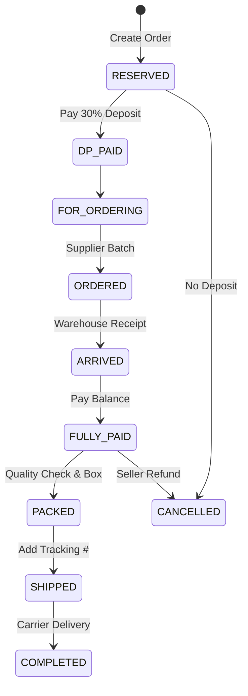
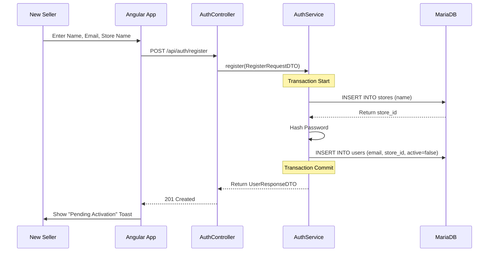
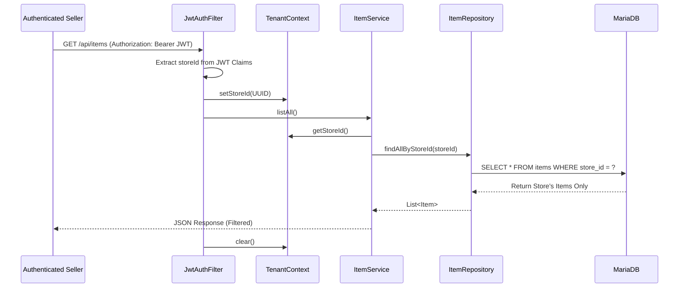
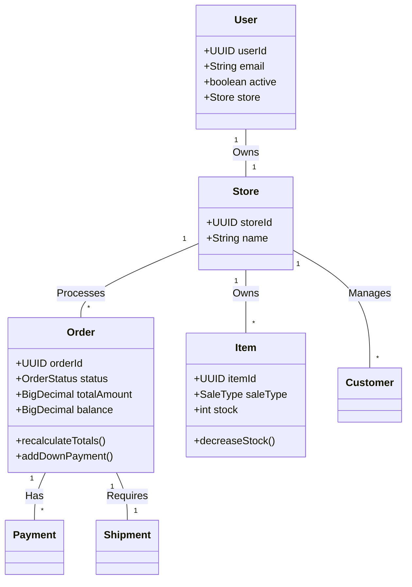

# MineBuddy: Multi-Tenant E-Commerce Platform

MineBuddy is a specialized e-commerce backend and frontend solution designed for social media sellers (e.g., Facebook Live). It features a robust **1-to-1 Multi-Tenancy Architecture**, ensuring complete data isolation between different stores.

## 🚀 Key Architectural Concepts

### 1. The "Logical Wall"
Data isolation is enforced at the database level and the application layer. Every business entity is "stamped" with a `store_id`.
*   **Zero-Knowledge Frontend:** The frontend never handles raw Store UUIDs. The identity is securely stored within the encrypted JWT.
*   **Automatic Context:** A `ThreadLocal` TenantContext manages the store identity for every request lifecycle.

---

## 📦 Orders: The Core Engine (Full CRUD)

The Order module is the heart of MineBuddy, designed to handle the fast-paced nature of social media selling where stock can be a mix of on-hand items and pre-orders.

### 1. Workflow State Machine
Orders follow a strict linear progression (with ranks) to ensure financial and logistical integrity.

| Status | Rank | Requirement |
| :--- | :---: | :--- |
| **RESERVED** | 1 | Initial state upon checkout. |
| **DP_PAID** | 2 | Down Payment (30%) received (for Pre-orders). |
| **FOR_ORDERING** | 3 | Ready to be included in supplier batch. |
| **ORDERED** | 4 | Order placed with the supplier. |
| **ARRIVED** | 5 | Item received at the seller's warehouse. |
| **FULLY_PAID** | 6 | Balance reaches zero. |
| **PACKED** | 7 | Item is boxed and ready for carrier pickup. |
| **SHIPPED** | 8 | Tracking number assigned and carrier has item. |
| **COMPLETED** | 9 | Final state: Shipment marked as DELIVERED. |
| **CANCELLED** | 99 | Terminal state for aborted transactions. |

### 2. Intelligent Fulfillment Logic
The `OrderService` automatically determines the fulfillment path based on item availability:
- **On-Hand Only:** Deducts stock immediately; fails if insufficient.
- **Pre-Order Only:** Accepts the order regardless of current stock; sets status to RESERVED.
- **Hybrid System:** The "Smart Split" — if a user wants 5 items but only 2 are in stock, the system automatically creates two linked orders: one for the 2 on-hand items and one for the 3 pre-order items.

### 3. Order Lifecycle Diagram

---

## 📊 Identity & Security Diagrams

### A. Registration & Onboarding

### B. Secure Request Handling (The Logical Wall)

---

## 🏗 Class Diagram

---

## 🛠 Technology Stack

### Backend (Spring Boot 4.0.3)
- **Security:** JWT with Refresh Token Rotation & BCrypt.
- **Persistence:** Hibernate 6 (JPA) with MariaDB.
- **Migrations:** Flyway (Versioned SQL).
- **Isolation:** Custom `TenantContext` + JPA `@PrePersist` hooks.

### Frontend (Angular 19+)
- **State:** Signals-based architecture.
- **Security:** Functional HTTP Interceptors.
- **UI:** Tailwind CSS with dynamic Admin/Super-Admin views.
