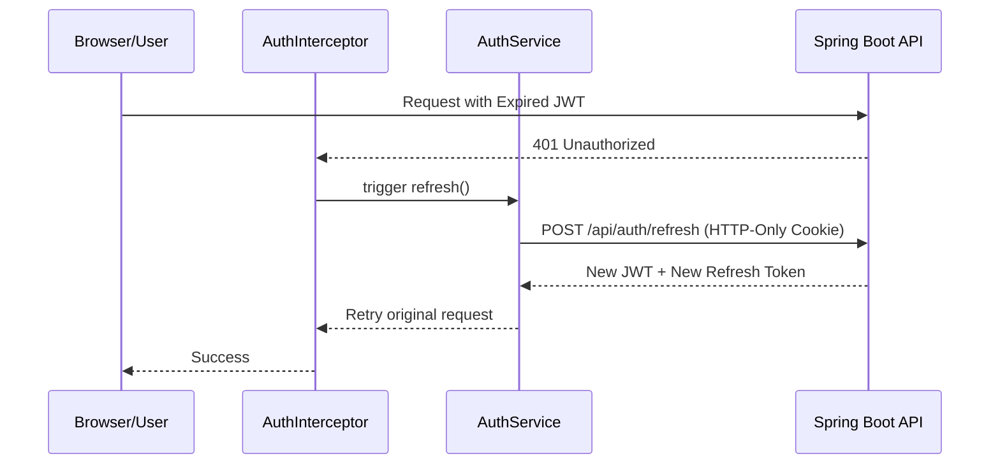

# MineBuddy: Angular Frontend Architecture

The MineBuddy frontend is a modern, high-performance web application built with **Angular 19**. It is designed to be reactive, secure, and visually polished using **Tailwind CSS**.

## 🏗 Architectural Pillars

### 1. Signals-Based State Management
The application leverages Angular's native **Signals** for granular reactivity. 
- **Reactive UI:** Components only re-render when the specific data they consume changes.
- **Zero Zone.js Dependency (Goal):** Preparing for a zoneless future for better performance.

### 2. Multi-Tenant Security Flow
The frontend is "tenant-unaware" by design to prevent data leaking. 
- **Identity via JWT:** The `store_id` is never manually handled; it is extracted by the backend from the encrypted JWT.
- **Refresh Token Rotation:** Automatically handles token expiration in the background using functional interceptors.



### 3. Functional HTTP Interceptors
Security and multitenancy logic is centralized in modern functional interceptors:
- **`authInterceptor`:** Attaches the `Authorization: Bearer <token>` header to every outgoing request.
- **`errorInterceptor`:** Handles global error states and redirects to login on session timeout.

## 🎨 UI & User Experience

### Responsive Design with Tailwind CSS
- **Utility-First:** Rapid UI development with consistent spacing and typography.
- **Responsive Layouts:** Seamless transition between desktop admin dashboards and mobile-friendly order trackers.

### Role-Based Access Control (RBAC)
The UI dynamically adapts based on the user's role:
- **Super-Admin:** Global store management and platform metrics.
- **Store-Admin:** Inventory, customers, and order fulfillment.
- **Staff:** Restricted access to daily operations.

## 🚀 Key Modules

| Module | Description |
| :--- | :--- |
| **Dashboard** | Real-time sales metrics and order volume via Signals. |
| **Inventory** | CRUD operations for Items with SaleType-specific UI. |
| **Orders** | Complex state machine management with batch arrival processing. |
| **Customers** | Address-integrated CRM with quick search. |

---

## 🛠 Setup & Development

### Requirements
- Node.js (Latest LTS)
- Angular CLI

### Commands
```bash
npm install          # Install dependencies
ng serve             # Run dev server
ng build --prod      # Production build
```
