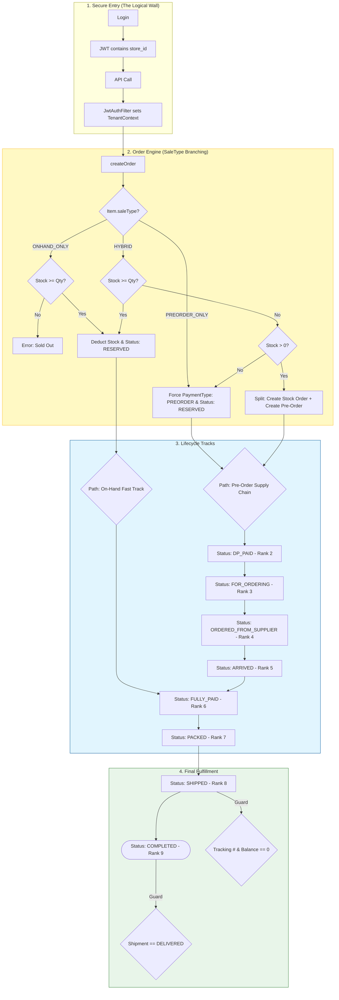

# MineBuddy: Order Management & Business Logic

The Order module is the most complex part of the MineBuddy ecosystem. It is designed to handle the high-volume, high-trust environment of Facebook Live selling, where items move quickly and payment is often split between deposits and final balances.

## 🏁 The Grand Lifecycle: Logic-Driven Fulfillment

This diagram reflects the exact technical implementation in the Java backend, specifically how the **Item SaleType** dictates the order's lifecycle track.

---

## 🧠 Business Logic Deep Dive

### 1. The "Smart Split" Hybrid Fulfillment
When a customer orders a quantity that exceeds current stock for a **HYBRID** item, the `OrderService` automatically splits the request:
- **Order A**: Fulfilled from current stock (immediate deduction).
- **Order B**: Placed as a pre-order for the remaining quantity.
- **Shipping**: The shipping fee is pro-rated between both orders to prevent double-billing.

### 2. Logic-Driven Tracks
The system intelligently determines which steps are required based on the **Item SaleType**:
- **On-Hand Track**: Skips supplier-related statuses (Ordering, Arrived) and moves directly from Payment to Packing.
- **Pre-Order Track**: Enforces a strict supply-chain sequence: `DP_PAID` ➡️ `FOR_ORDERING` ➡️ `ORDERED` ➡️ `ARRIVED`.

### 3. State Machine & Rank Constraints
To maintain financial and logistical integrity, orders follow a strict rank-based progression:

| Status | Rank | Logical Requirement |
| :--- | :---: | :--- |
| **RESERVED** | 1 | Initial state. Inventory is committed. |
| **DP_PAID** | 2 | Verified by `totalPaid >= dpRequired`. |
| **FULLY_PAID** | 6 | Balance must be exactly zero. |
| **SHIPPED** | 8 | Requires **Tracking Number** AND **Zero Balance**. |
| **COMPLETED** | 9 | Requires Shipment record to be marked as **DELIVERED**. |

---

## 🛡 Security & Integrity
- **Multi-Tenant Isolation**: Every transaction is protected by the **TenantContext**, ensuring store-level data isolation.
- **Automatic Stock Restoration**: When an order is cancelled or edited, the `Item` inventory is automatically restored.
- **Financial Protection**: Orders with paid deposits are locked from simple cancellation to protect financial history.
